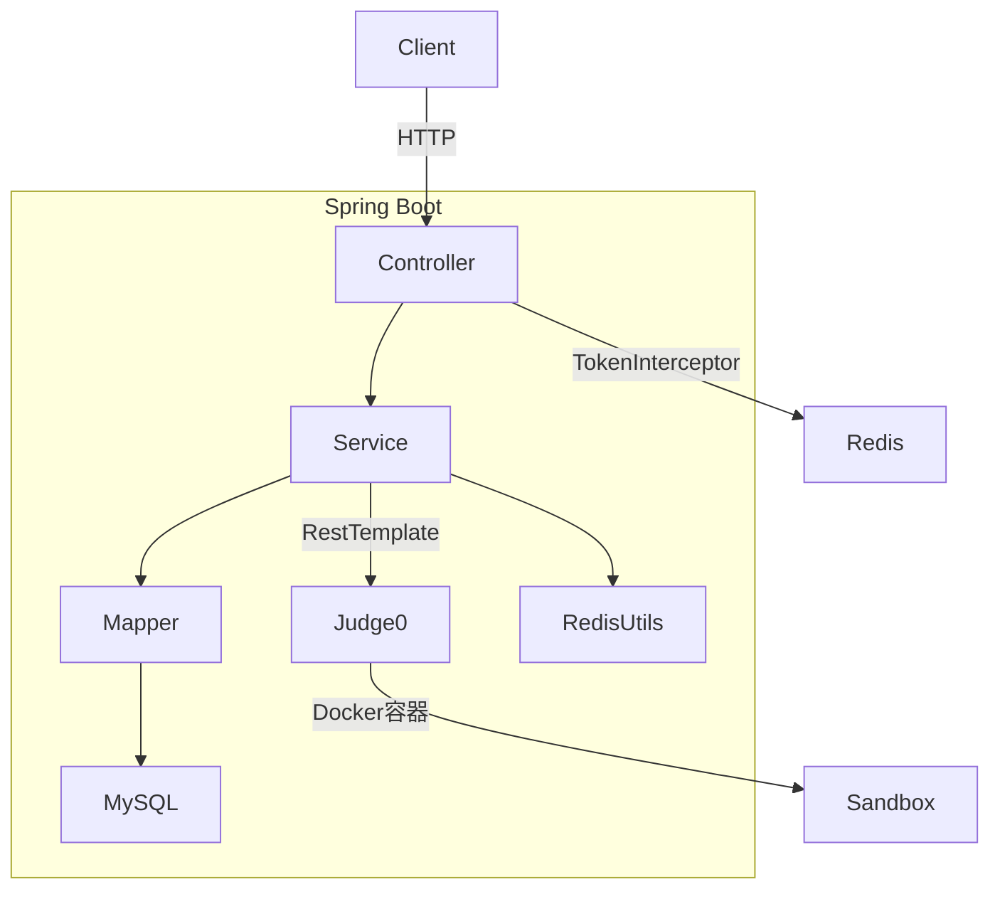
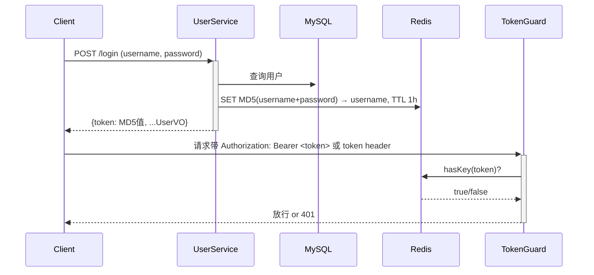
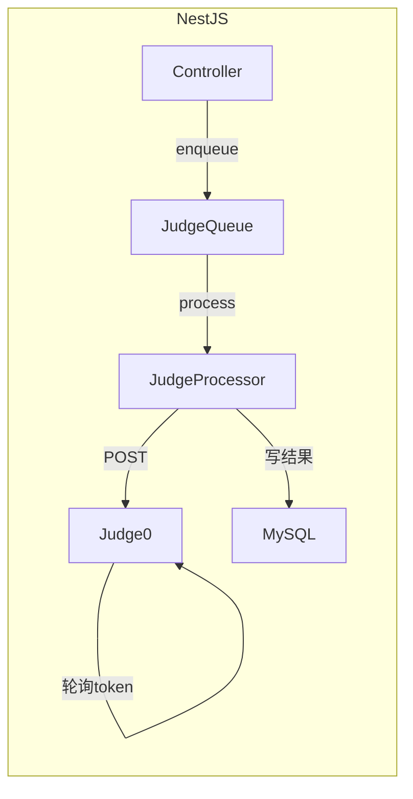

# Java OJ → NestJS 迁移方案

## 现有 Java 架构速览



**技术栈对比**

- Java Spring Boot → NestJS (TypeScript)
- MyBatis Plus → TypeORM
- Spring `@Async` + 线程池 → Bull 队列
- `TokenInterceptor` + Redis → NestJS `Guard` + Redis
- `RestTemplate` → `@nestjs/axios`
- Guava BloomFilter → `bloom-filters` npm 包

---

## 目标 NestJS 结构

```
backend/oj-nest/
├── src/
│   ├── main.ts
│   ├── app.module.ts
│   ├── common/
│   │   ├── guards/token.guard.ts        ← 对应 TokenInterceptor
│   │   ├── filters/http-exception.filter.ts
│   │   ├── interceptors/response.interceptor.ts  ← 统一 Result<T> 格式
│   │   └── decorators/current-user.decorator.ts
│   ├── config/
│   │   ├── database.config.ts
│   │   ├── redis.config.ts
│   │   └── judge0.config.ts
│   ├── modules/
│   │   ├── user/                        ← /api/user
│   │   ├── question/                    ← /api/testQuestion + /api/user/testQuestion
│   │   ├── comment/                     ← /api/comment
│   │   └── judge/                       ← Judge0 集成服务
│   └── entities/                        ← TypeORM 实体
│       ├── user.entity.ts
│       ├── questions.entity.ts
│       ├── test-point.entity.ts
│       ├── user-submission-code.entity.ts
│       ├── user-submission-record.entity.ts
│       ├── comment.entity.ts
│       └── comment-like.entity.ts
├── .env
└── package.json
```

---

## 接口对照（完整保持不变）

**用户模块** `/api/user`

- POST `/login` — 无需 Token
- POST `/register` — 无需 Token
- POST `/logout` — Header: `token`
- POST `/changePassword` — Header: `Authorization`
- PUT `/info` — Header: `Authorization`
- GET `/status` — Header: `Authorization`

**管理题目模块** `/api/testQuestion` — 需 Token

- GET `/getTestQuestionByPage`、`/getTestQuestionCount`、`/getTestQuestionById`
- POST `/addTestQuestion`、`/updateTestQuestion`
- DELETE `/deleteTestQuestionById`
- GET `/getTestPointsListByQuestionId`

**用户题目模块** `/api/user/testQuestion` — 需 Token

- GET `/getTestQuestionByPage`、`/getTestQuestionById`、`/getTestQuestionByName`、`/getTestPointsListByQuestionId`
- POST `/submitTestQuestion`

**评论模块** `/api/comment` — 需 Token

- POST `/addComment`、`/addCommentLike`
- GET `/getComment`、`/getComments`
- DELETE `/deleteComment`、`/cancelCommentLike`

---

## Auth Token 机制（与 Java 保持一致）



---

## 判题异步流程（Java @Async → Bull 队列）



---

## 实施任务（按顺序）

1. **初始化项目** — `nest new oj-nest`，安装依赖
2. **TypeORM 实体** — 按 7 张表创建 entity，与现有 MySQL schema 对齐
3. **公共层** — Guard、Filter、Interceptor、Decorator
4. **配置层** — DB/Redis/Judge0 的 ConfigModule
5. **User 模块** — Controller + Service + DTO
6. **Question 模块** — Admin + User 两个 Controller，共享 Service
7. **Comment 模块** — Controller + Service + DTO
8. **Judge 服务** — Judge0 HTTP 调用 + Bull 异步队列
9. **环境配置** — `.env` 文件 + Docker Compose

---

## 关键依赖

```
@nestjs/typeorm  typeorm  mysql2
@nestjs/config
ioredis  @nestjs-modules/ioredis
@nestjs/axios  axios
@nestjs/bull  bull
class-validator  class-transformer
crypto-js  (MD5 token)
```

---

## 注意事项（Java 坑已排查）

- Java `logout` 未真正删除 Redis key，NestJS 版应**补全**删 key 逻辑
- `Judge0Config` 中的 URL（localhost:2380）与 `IPConstants`（Docker 容器名:2358）**不一致**，统一用环境变量 `JUDGE0_BASE_URL`
- `changePassword`/`info`/`status` 接受**裸 token**（无 `Bearer ` 前缀），Guard 需同时兼容两种格式
- Judge0 `status.id=3` → AC，`5` → TLE，其他非 3 → RE
