<div align="center">

# AI-Full-Stack-OJ-System

<br/>


<br/><br/>


<br/><br/>

</div>

<div align="center">



</div>

## 目录结构

```
Campus-OJ-Platform/
├── frontend/              # Vue3 前端
├── backend/
│   ├── oj-nest/           # NestJS 主后端（业务核心）
│   │   └── database/      # 本地库表初始化 SQL
│   ├── oj-recommend-py/   # FastAPI + LangChain AI 推荐
│   └── oj-docker-java/    # 旧版 Java 后端（已弃用，仅留存）
└── README.md
```

## 怎么用

需要先准备好 MySQL、Redis、Judge0。MySQL 表结构需手动导入（TypeORM `synchronize: false`）。

### 0. 本地构建数据库

```bash
cd backend/oj-nest
docker compose up -d mysql redis
```

等待 MySQL 就绪后导入建表脚本（`backend/oj-nest/database/本地构建数据库.sql`）：

```bash
# Docker 内执行
docker exec -i oj-mysql mysql -uroot -p1234 oj < database/本地构建数据库.sql

# 或本机 mysql 客户端
mysql -h127.0.0.1 -P3306 -uroot -p1234 oj < database/本地构建数据库.sql
```

| 组件 | 默认值 |
| ---- | ------ |
| MySQL | `root` / `1234`，库 `oj`，端口 `3306` |
| Redis | 无密码，端口 `6379` |
| 演示账号 | `admin` / `123456`（管理员） |

Nest `.env` 与 `oj-recommend-py/config/settings.py` 中的 `MYSQL_CONFIG` / `REDIS_*` 需与上表一致。

### 1. 启动主后端 NestJS

```bash
cd backend/oj-nest
npm install
npm run start:dev        # 默认 http://localhost:8080
```

`.env` 示例：

```env
DB_HOST=localhost
DB_PORT=3306
DB_USERNAME=root
DB_PASSWORD=1234
DB_DATABASE=oj
REDIS_HOST=localhost
REDIS_PORT=6379
REDIS_PASSWORD=
REDIS_DB=0
JUDGE0_BASE_URL=http://localhost:2358
TOKEN_TTL=3600
```

### 2. 启动 AI 推荐后端 FastAPI

```bash
cd backend/oj-recommend-py
uv sync
uv run python main.py    # 默认 http://localhost:8000
```

`config/settings.py` 中配置 `LLM_CONFIG` 的 `api_key` / `model` / `base_url`。

### 3. 启动前端 Vue3

```bash
cd frontend
npm install
npm run dev              # 默认 http://localhost:5173
```

### 4. 一键容器化（仅 Nest + 中间件）

```bash
cd backend/oj-nest
docker-compose up -d
```

## 端口约定

| 服务         | 端口 |
| ------------ | ---- |
| 前端 Vite    | 5173 |
| Nest 主后端  | 8080 |
| FastAPI AI   | 8000 |
| MySQL        | 3306 |
| Redis        | 6379 |
| Judge0       | 2358 |
